# Diagramas de AFDs da Linguagem Scriptum
 
Cada diagrama abaixo utiliza notação Mermaid (`stateDiagram-v2`) para representar a automação determinística resultante das expressões regulares.

## WHITESPACE
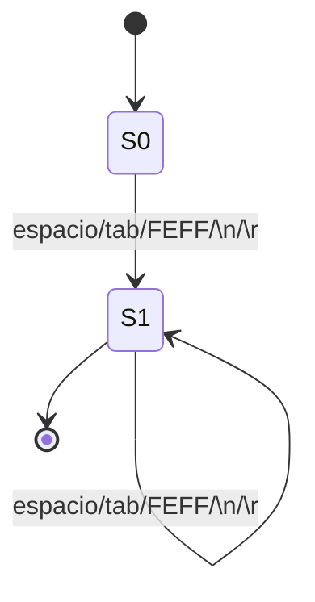

## COMMENT_LINE (`//...`)
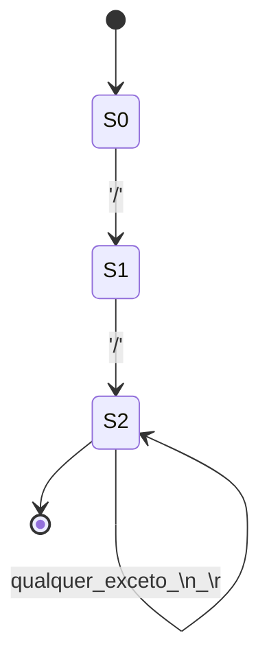

## COMMENT_BLOCK (`/* ... */`)
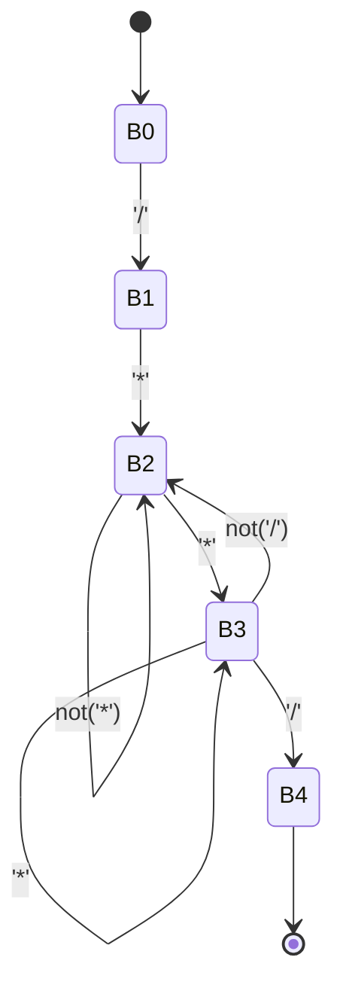

## IDENTIFIER
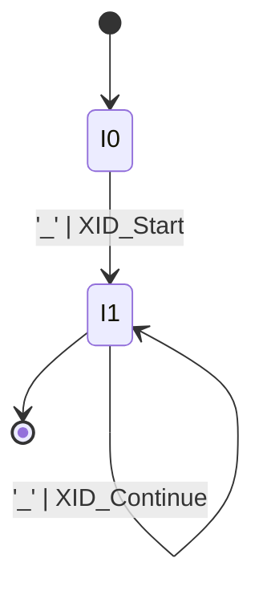

## KEYWORDS
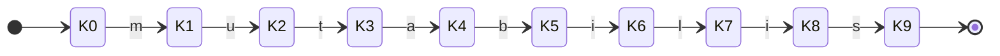

## INT_DECIMAL
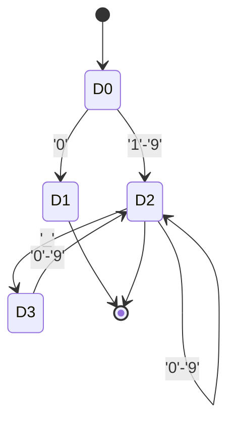

## INT_BINARY
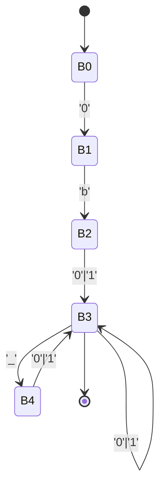

## INT_OCTAL
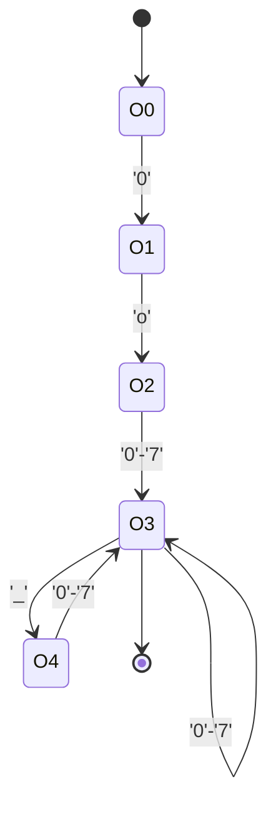

## INT_HEX
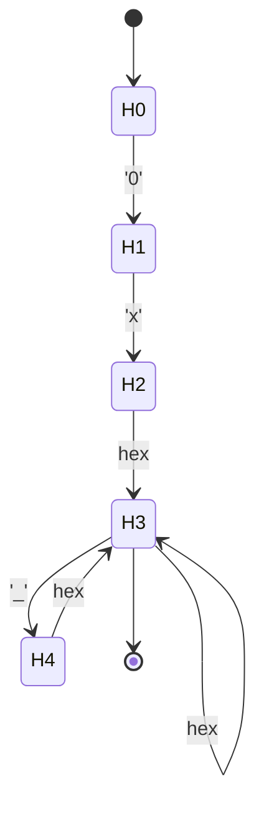

## FLOAT_DECIMAL
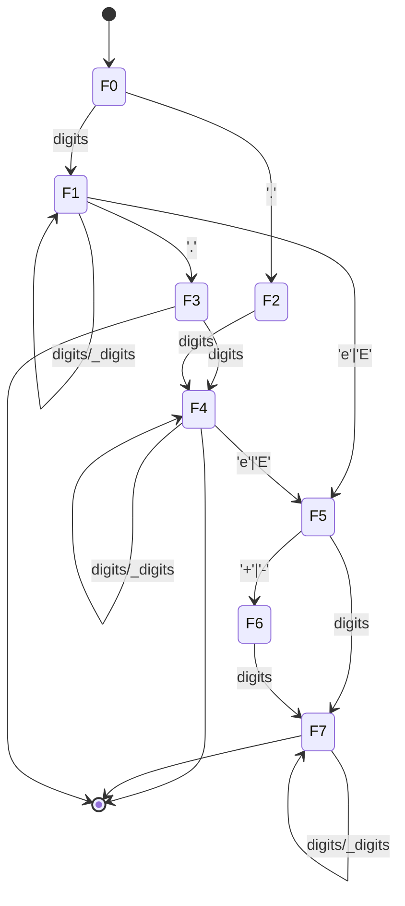

## NUMERIC_LITERAL (com sufixo opcional)
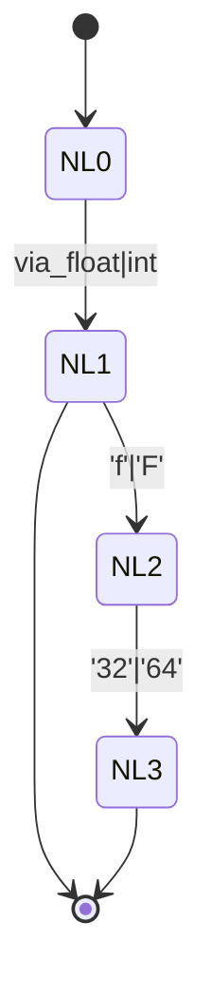

## STRING_LITERAL
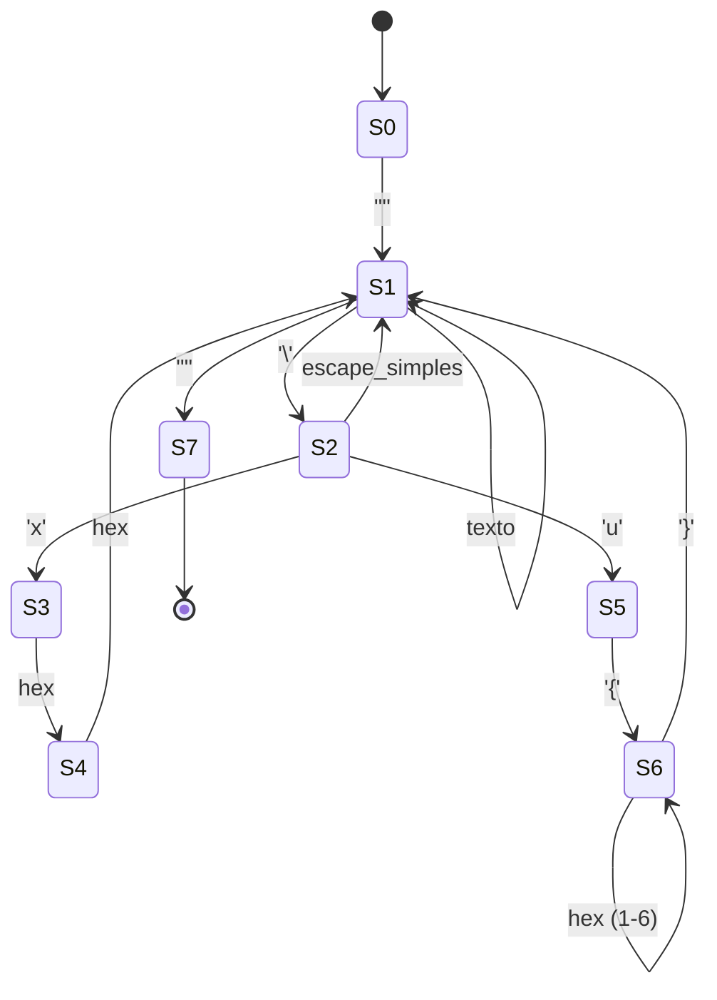

## OPERATORS
```mermaid
stateDiagram-v2
  direction LR
  [*] --> Ope0

  %% 1º caractere: classe de operadores e pontuação relevante
  Ope0 --> Ope1: &#42; | &#61; | &#33; | &#60; | &#62; | &#38; | &#124; | &#63; | &#43; | &#45; | &#47; | &#37; | &#58;

  %% 2º caractere (tokens duplos): ==, !=, <=, >=, &&, ||, ??, +=, -=, *=, /=, %=, :=
  Ope1 --> Ope2: segundo_caractere

  %% 3º caractere (tokens triplos): ===, !==
  Ope2 --> Ope3: terceiro_caractere

  %% Aceitações por comprimento
  Ope1 --> [*]
  Ope2 --> [*]
  Ope3 --> [*]
```

## DELIMITERS
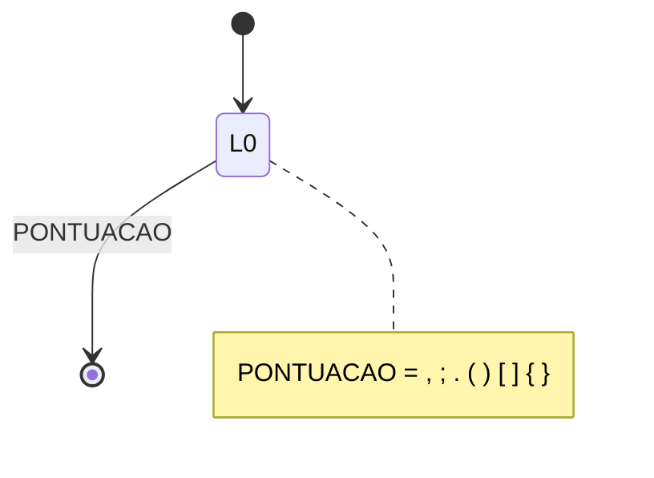
