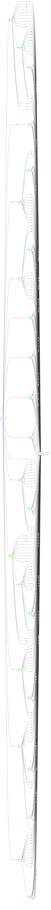

# AFD para Operadores

```mermaid
graph LR
  S0 -- "!" --> S1
  S0 -- "%" --> S2
  S0 -- "&" --> S3
  S0 -- "*" --> S4
  S0 -- "+" --> S5
  S0 -- "-" --> S6
  S0 -- "." --> S7
  S0 -- "/" --> S8
  S0 -- ":" --> S9
  S0 -- "<" --> S10
  S0 -- "=" --> S11
  S0 -- ">" --> S12
  S0 -- "?" --> S13
  S0 -- "|" --> S14
  S1 -- "!" --> S9
  S1 -- "%" --> S9
  S1 -- "&" --> S9
  S1 -- "*" --> S9
  S1 -- "+" --> S9
  S1 -- "-" --> S9
  S1 -- "." --> S9
  S1 -- "/" --> S9
  S1 -- ":" --> S9
  S1 -- "<" --> S9
  S1 -- "=" --> S15
  S1 -- ">" --> S9
  S1 -- "?" --> S9
  S1 -- "|" --> S9
  S2 -- "!" --> S9
  S2 -- "%" --> S9
  S2 -- "&" --> S9
  S2 -- "*" --> S9
  S2 -- "+" --> S9
  S2 -- "-" --> S9
  S2 -- "." --> S9
  S2 -- "/" --> S9
  S2 -- ":" --> S9
  S2 -- "<" --> S9
  S2 -- "=" --> S9
  S2 -- ">" --> S9
  S2 -- "?" --> S9
  S2 -- "|" --> S9
  S3 -- "!" --> S9
  S3 -- "%" --> S9
  S3 -- "&" --> S16
  S3 -- "*" --> S9
  S3 -- "+" --> S9
  S3 -- "-" --> S9
  S3 -- "." --> S9
  S3 -- "/" --> S9
  S3 -- ":" --> S9
  S3 -- "<" --> S9
  S3 -- "=" --> S9
  S3 -- ">" --> S9
  S3 -- "?" --> S9
  S3 -- "|" --> S9
  S4 -- "!" --> S9
  S4 -- "%" --> S9
  S4 -- "&" --> S9
  S4 -- "*" --> S17
  S4 -- "+" --> S9
  S4 -- "-" --> S9
  S4 -- "." --> S9
  S4 -- "/" --> S9
  S4 -- ":" --> S9
  S4 -- "<" --> S9
  S4 -- "=" --> S9
  S4 -- ">" --> S9
  S4 -- "?" --> S9
  S4 -- "|" --> S9
  S5 -- "!" --> S9
  S5 -- "%" --> S9
  S5 -- "&" --> S9
  S5 -- "*" --> S9
  S5 -- "+" --> S9
  S5 -- "-" --> S9
  S5 -- "." --> S9
  S5 -- "/" --> S9
  S5 -- ":" --> S9
  S5 -- "<" --> S9
  S5 -- "=" --> S9
  S5 -- ">" --> S9
  S5 -- "?" --> S9
  S5 -- "|" --> S9
  S6 -- "!" --> S9
  S6 -- "%" --> S9
  S6 -- "&" --> S9
  S6 -- "*" --> S9
  S6 -- "+" --> S9
  S6 -- "-" --> S9
  S6 -- "." --> S9
  S6 -- "/" --> S9
  S6 -- ":" --> S9
  S6 -- "<" --> S9
  S6 -- "=" --> S9
  S6 -- ">" --> S9
  S6 -- "?" --> S9
  S6 -- "|" --> S9
  S7 -- "!" --> S9
  S7 -- "%" --> S9
  S7 -- "&" --> S9
  S7 -- "*" --> S9
  S7 -- "+" --> S9
  S7 -- "-" --> S9
  S7 -- "." --> S9
  S7 -- "/" --> S9
  S7 -- ":" --> S9
  S7 -- "<" --> S9
  S7 -- "=" --> S9
  S7 -- ">" --> S9
  S7 -- "?" --> S9
  S7 -- "|" --> S9
  S8 -- "!" --> S9
  S8 -- "%" --> S9
  S8 -- "&" --> S9
  S8 -- "*" --> S9
  S8 -- "+" --> S9
  S8 -- "-" --> S9
  S8 -- "." --> S9
  S8 -- "/" --> S9
  S8 -- ":" --> S9
  S8 -- "<" --> S9
  S8 -- "=" --> S9
  S8 -- ">" --> S9
  S8 -- "?" --> S9
  S8 -- "|" --> S9
  S9 -- "!" --> S9
  S9 -- "%" --> S9
  S9 -- "&" --> S9
  S9 -- "*" --> S9
  S9 -- "+" --> S9
  S9 -- "-" --> S9
  S9 -- "." --> S9
  S9 -- "/" --> S9
  S9 -- ":" --> S9
  S9 -- "<" --> S9
  S9 -- "=" --> S9
  S9 -- ">" --> S9
  S9 -- "?" --> S9
  S9 -- "|" --> S9
  S10 -- "!" --> S9
  S10 -- "%" --> S9
  S10 -- "&" --> S9
  S10 -- "*" --> S9
  S10 -- "+" --> S9
  S10 -- "-" --> S9
  S10 -- "." --> S9
  S10 -- "/" --> S9
  S10 -- ":" --> S9
  S10 -- "<" --> S9
  S10 -- "=" --> S18
  S10 -- ">" --> S9
  S10 -- "?" --> S9
  S10 -- "|" --> S9
  S11 -- "!" --> S9
  S11 -- "%" --> S9
  S11 -- "&" --> S9
  S11 -- "*" --> S9
  S11 -- "+" --> S9
  S11 -- "-" --> S9
  S11 -- "." --> S9
  S11 -- "/" --> S9
  S11 -- ":" --> S9
  S11 -- "<" --> S9
  S11 -- "=" --> S19
  S11 -- ">" --> S9
  S11 -- "?" --> S9
  S11 -- "|" --> S9
  S12 -- "!" --> S9
  S12 -- "%" --> S9
  S12 -- "&" --> S9
  S12 -- "*" --> S9
  S12 -- "+" --> S9
  S12 -- "-" --> S9
  S12 -- "." --> S9
  S12 -- "/" --> S9
  S12 -- ":" --> S9
  S12 -- "<" --> S9
  S12 -- "=" --> S20
  S12 -- ">" --> S9
  S12 -- "?" --> S9
  S12 -- "|" --> S9
  S13 -- "!" --> S9
  S13 -- "%" --> S9
  S13 -- "&" --> S9
  S13 -- "*" --> S9
  S13 -- "+" --> S9
  S13 -- "-" --> S9
  S13 -- "." --> S9
  S13 -- "/" --> S9
  S13 -- ":" --> S21
  S13 -- "<" --> S9
  S13 -- "=" --> S9
  S13 -- ">" --> S9
  S13 -- "?" --> S22
  S13 -- "|" --> S9
  S14 -- "!" --> S9
  S14 -- "%" --> S9
  S14 -- "&" --> S9
  S14 -- "*" --> S9
  S14 -- "+" --> S9
  S14 -- "-" --> S9
  S14 -- "." --> S9
  S14 -- "/" --> S9
  S14 -- ":" --> S9
  S14 -- "<" --> S9
  S14 -- "=" --> S9
  S14 -- ">" --> S9
  S14 -- "?" --> S9
  S14 -- "|" --> S23
  S15 -- "!" --> S9
  S15 -- "%" --> S9
  S15 -- "&" --> S9
  S15 -- "*" --> S9
  S15 -- "+" --> S9
  S15 -- "-" --> S9
  S15 -- "." --> S9
  S15 -- "/" --> S9
  S15 -- ":" --> S9
  S15 -- "<" --> S9
  S15 -- "=" --> S24
  S15 -- ">" --> S9
  S15 -- "?" --> S9
  S15 -- "|" --> S9
  S16 -- "!" --> S9
  S16 -- "%" --> S9
  S16 -- "&" --> S9
  S16 -- "*" --> S9
  S16 -- "+" --> S9
  S16 -- "-" --> S9
  S16 -- "." --> S9
  S16 -- "/" --> S9
  S16 -- ":" --> S9
  S16 -- "<" --> S9
  S16 -- "=" --> S9
  S16 -- ">" --> S9
  S16 -- "?" --> S9
  S16 -- "|" --> S9
  S17 -- "!" --> S9
  S17 -- "%" --> S9
  S17 -- "&" --> S9
  S17 -- "*" --> S9
  S17 -- "+" --> S9
  S17 -- "-" --> S9
  S17 -- "." --> S9
  S17 -- "/" --> S9
  S17 -- ":" --> S9
  S17 -- "<" --> S9
  S17 -- "=" --> S9
  S17 -- ">" --> S9
  S17 -- "?" --> S9
  S17 -- "|" --> S9
  S18 -- "!" --> S9
  S18 -- "%" --> S9
  S18 -- "&" --> S9
  S18 -- "*" --> S9
  S18 -- "+" --> S9
  S18 -- "-" --> S9
  S18 -- "." --> S9
  S18 -- "/" --> S9
  S18 -- ":" --> S9
  S18 -- "<" --> S9
  S18 -- "=" --> S9
  S18 -- ">" --> S9
  S18 -- "?" --> S9
  S18 -- "|" --> S9
  S19 -- "!" --> S9
  S19 -- "%" --> S9
  S19 -- "&" --> S9
  S19 -- "*" --> S9
  S19 -- "+" --> S9
  S19 -- "-" --> S9
  S19 -- "." --> S9
  S19 -- "/" --> S9
  S19 -- ":" --> S9
  S19 -- "<" --> S9
  S19 -- "=" --> S25
  S19 -- ">" --> S9
  S19 -- "?" --> S9
  S19 -- "|" --> S9
  S20 -- "!" --> S9
  S20 -- "%" --> S9
  S20 -- "&" --> S9
  S20 -- "*" --> S9
  S20 -- "+" --> S9
  S20 -- "-" --> S9
  S20 -- "." --> S9
  S20 -- "/" --> S9
  S20 -- ":" --> S9
  S20 -- "<" --> S9
  S20 -- "=" --> S9
  S20 -- ">" --> S9
  S20 -- "?" --> S9
  S20 -- "|" --> S9
  S21 -- "!" --> S9
  S21 -- "%" --> S9
  S21 -- "&" --> S9
  S21 -- "*" --> S9
  S21 -- "+" --> S9
  S21 -- "-" --> S9
  S21 -- "." --> S9
  S21 -- "/" --> S9
  S21 -- ":" --> S9
  S21 -- "<" --> S9
  S21 -- "=" --> S9
  S21 -- ">" --> S9
  S21 -- "?" --> S9
  S21 -- "|" --> S9
  S22 -- "!" --> S9
  S22 -- "%" --> S9
  S22 -- "&" --> S9
  S22 -- "*" --> S9
  S22 -- "+" --> S9
  S22 -- "-" --> S9
  S22 -- "." --> S9
  S22 -- "/" --> S9
  S22 -- ":" --> S9
  S22 -- "<" --> S9
  S22 -- "=" --> S9
  S22 -- ">" --> S9
  S22 -- "?" --> S9
  S22 -- "|" --> S9
  S23 -- "!" --> S9
  S23 -- "%" --> S9
  S23 -- "&" --> S9
  S23 -- "*" --> S9
  S23 -- "+" --> S9
  S23 -- "-" --> S9
  S23 -- "." --> S9
  S23 -- "/" --> S9
  S23 -- ":" --> S9
  S23 -- "<" --> S9
  S23 -- "=" --> S9
  S23 -- ">" --> S9
  S23 -- "?" --> S9
  S23 -- "|" --> S9
  S24 -- "!" --> S9
  S24 -- "%" --> S9
  S24 -- "&" --> S9
  S24 -- "*" --> S9
  S24 -- "+" --> S9
  S24 -- "-" --> S9
  S24 -- "." --> S9
  S24 -- "/" --> S9
  S24 -- ":" --> S9
  S24 -- "<" --> S9
  S24 -- "=" --> S9
  S24 -- ">" --> S9
  S24 -- "?" --> S9
  S24 -- "|" --> S9
  S25 -- "!" --> S9
  S25 -- "%" --> S9
  S25 -- "&" --> S9
  S25 -- "*" --> S9
  S25 -- "+" --> S9
  S25 -- "-" --> S9
  S25 -- "." --> S9
  S25 -- "/" --> S9
  S25 -- ":" --> S9
  S25 -- "<" --> S9
  S25 -- "=" --> S9
  S25 -- ">" --> S9
  S25 -- "?" --> S9
  S25 -- "|" --> S9
  class S1 final;
  %% final S1 = OP_BANG
  class S2 final;
  %% final S2 = OP_PERCENT
  class S4 final;
  %% final S4 = OP_STAR
  class S5 final;
  %% final S5 = OP_PLUS
  class S6 final;
  %% final S6 = OP_MINUS
  class S7 final;
  %% final S7 = OP_DOT
  class S8 final;
  %% final S8 = OP_SLASH
  class S10 final;
  %% final S10 = OP_LT
  class S11 final;
  %% final S11 = OP_EQ
  class S12 final;
  %% final S12 = OP_GT
  class S15 final;
  %% final S15 = OP_BANG_EQ
  class S16 final;
  %% final S16 = OP_AMP_AMP
  class S17 final;
  %% final S17 = OP_STAR_STAR
  class S18 final;
  %% final S18 = OP_LT_EQ
  class S19 final;
  %% final S19 = OP_EQ_EQ
  class S20 final;
  %% final S20 = OP_GT_EQ
  class S21 final;
  %% final S21 = OP_QMARK_COLON
  class S22 final;
  %% final S22 = OP_QMARK_QMARK
  class S23 final;
  %% final S23 = OP_BAR_BAR
  class S24 final;
  %% final S24 = OP_BANG_EQ_EQ
  class S25 final;
  %% final S25 = OP_EQ_EQ_EQ
classDef final fill:#e0ffe0,stroke:#0a0,stroke-width:1px;
```
